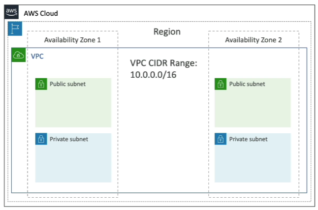
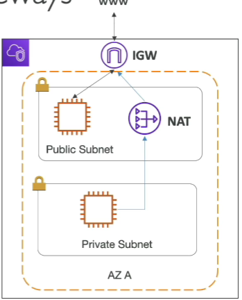
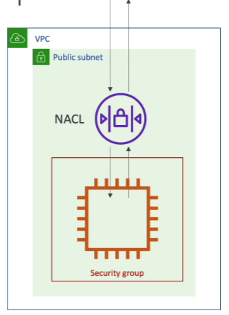
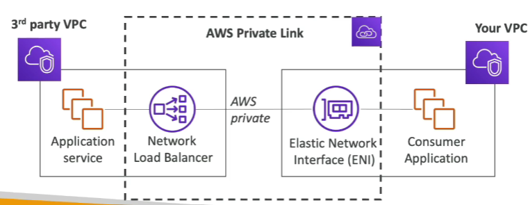

# VPC

- [VPC](#vpc)
  - [IP Addresses](#ip-addresses)
  - [VPC \& Subnets Primer](#vpc--subnets-primer)
  - [Internet Gateway (IGW)](#internet-gateway-igw)
  - [NAT Gateway](#nat-gateway)
  - [NAT Gateway vs NAT Instance](#nat-gateway-vs-nat-instance)
  - [Network ACL \& Security Groups](#network-acl--security-groups)
    - [Network ACLs vs Security Groups](#network-acls-vs-security-groups)
  - [VPC Flow Logs](#vpc-flow-logs)
  - [VPC Peering](#vpc-peering)
  - [VPC Endpoints](#vpc-endpoints)
  - [AWS PrivateLink (VPC Endpoints Services)](#aws-privatelink-vpc-endpoints-services)
  - [Site to Site VPN \& Direct Connect](#site-to-site-vpn--direct-connect)
  - [AWS Client VPN](#aws-client-vpn)
  - [Transit Gateway](#transit-gateway)
  - [VPC Summary](#vpc-summary)

## IP Addresses

- **IPv4 - Internet Protocol version 4 (4.3 Billion Addresses)**
  - **Public IPv4** - can be used on the internet
  - EC2 instance gets a new public IP address every time you stop then start it **(default)**
  - **Private IPv4** - can be used on private networks (LAN) such as internal AWS networking
  - Private IPv4 is fixed for EC3 instances even if you start/stop them
- **Elastic IP** - Allows you to attach a fixed public IPv4 address to EC2 instance.
- **Note: all public IPv4 on AWS will be charged $0.005 per hour (including EIP)**
  - Free Tier: 750 hours usage per month
- **IPv6 - Internet Protocol version 6 (340 Undecillion Addresses)**
  - Every IP address is public in AWS (no private range)
  - Example: 2600:1f18:1b2c:3d4e:5f6g:7h8i:9j0k:1l2m
  - Free

## VPC & Subnets Primer

- **VPC -Virtual Private Cloud**: private network to deploy your resources (regional resource)
- **Subnet**: Subnets allow you to partition your network inside your VPC (Availability Zone resource)
  - A **public subnet** is a subnet that is accessible from the internet
  - A **private subnet** is a subnet that is not accessible from the internet
- To define access to the internet and between subnets, we use **Route Tables**.

## Internet Gateway (IGW)

- **Internet Gateways** helps our VPC instances to connect with the internet
- Public Subnets have a route to the Internet Gateway
- Allows instances in the VPC to directly communicate with the internet.
- Essential for a public subnet in a VPC to send/receive traffic to/from the internet.

## NAT Gateway

- Allows instances in a private subnet to initiate outbound traffic to the internet while remaining private.
- Prevents unsolicited inbound traffic from reaching those instances.
- Used for scenarios where instances need to download patches, updates, etc., but should not be directly accessed from the internet.
- Managed by AWS

## NAT Gateway vs NAT Instance

| Attribute            | NAT gateway                                                                                                                                                                                                       | NAT instance                                                                                                                                                                      |
| -------------------- | ----------------------------------------------------------------------------------------------------------------------------------------------------------------------------------------------------------------- | --------------------------------------------------------------------------------------------------------------------------------------------------------------------------------- |
| Availability         | Highly available. NAT gateways in each Availability Zone are implemented with redundancy. Create a NAT gateway in each Availability Zone to ensure zone-independent architecture.                                 | Use a script to manage failover between instances.                                                                                                                                |
| Bandwidth            | Scale up to 100 Gbps.                                                                                                                                                                                             | Depends on the bandwidth of the instance type.                                                                                                                                    |
| Maintenance          | Managed by AWS. You do not need to perform any maintenance.                                                                                                                                                       | Managed by you, for example, by installing software updates or operating system patches on the instance.                                                                          |
| Performance          | Software is optimized for handling NAT traffic.                                                                                                                                                                   | A generic AMI that's configured to perform NAT.                                                                                                                                   |
| Cost                 | Charged depending on the number of NAT gateways you use, duration of usage, and amount of data that you send through the NAT gateways.                                                                            | Charged depending on the number of NAT instances that you use, duration of usage, and instance type and size.                                                                     |
| Type and size        | Uniform offering; you don’t need to decide on the type or size.                                                                                                                                                   | Choose a suitable instance type and size, according to your predicted workload.                                                                                                   |
| Public IP addresses  | Choose the Elastic IP address to associate with a public NAT gateway at creation.                                                                                                                                 | Use an Elastic IP address or a public IP address with a NAT instance. You can change the public IP address at any time by associating a new Elastic IP address with the instance. |
| Private IP addresses | Automatically selected from the subnet's IP address range when you create the gateway.                                                                                                                            | Assign a specific private IP address from the subnet's IP address range when you launch the instance.                                                                             |
| Security groups      | You cannot associate security groups with NAT gateways. You can associate them with the resources behind the NAT gateway to control inbound and outbound traffic.                                                 | Associate with your NAT instance and the resources behind your NAT instance to control inbound and outbound traffic.                                                              |
| Network ACLs         | Use a network ACL to control the traffic to and from the subnet in which your NAT gateway resides.                                                                                                                | Use a network ACL to control the traffic to and from the subnet in which your NAT instance resides.                                                                               |
| Flow logs            | Use flow logs to capture the traffic.                                                                                                                                                                             | Use flow logs to capture the traffic.                                                                                                                                             |
| Port forwarding      | Not supported.                                                                                                                                                                                                    | Manually customize the configuration to support port forwarding.                                                                                                                  |
| Bastion servers      | Not supported.                                                                                                                                                                                                    | Use as a bastion server.                                                                                                                                                          |
| Traffic metrics      | View CloudWatch metrics for the NAT gateway.                                                                                                                                                                      | View CloudWatch metrics for the instance.                                                                                                                                         |
| Timeout behavior     | When a connection times out, a NAT gateway returns an RST packet to any resources behind the NAT gateway that attempt to continue the connection (it does not send a FIN packet).                                 | When a connection times out, a NAT instance sends a FIN packet to resources behind the NAT instance to close the connection.                                                      |
| IP fragmentation     | Supports forwarding of IP fragmented packets for the UDP protocol.               Does not support fragmentation for the TCP and ICMP protocols. Fragmented   packets for these protocols will get dropped.  | Supports reassembly of IP fragmented packets for the UDP, TCP, and ICMP protocols.                                                                                                |

## Network ACL & Security Groups

- **NACL (Network Access Control List)**
  - A firewall which controls traffic from and to subnet
  - Can have ALLOW and DENY rules
  - Are attached at the Subnet level
  - Rules only include IP addresses
- **Security Groups**
  - A firewall that controls traffic to and from an ENI / an EC2 Instance
  - Can have only ALLOW rules
  - Rules include IP addresses and other security groups
 
### Network ACLs vs Security Groups

| Security Group                                                                                                                                               | Network ACL                                                                                                                                           |
| ------------------------------------------------------------------------------------------------------------------------------------------------------------ | ----------------------------------------------------------------------------------------------------------------------------------------------------- |
| Operates at the instance level                                                                                                                               | Operates at the subnet level                                                                                                                          |
| Supports allow rules only                                                                                                                                    | Supports allow rules and deny rules                                                                                                                   |
| Is stateful: Return traffic is automatically allowed, regardless of any rules                                                                                | Is stateless: Return traffic must be explicitly allowed by rules                                                                                      |
| We evaluate all rules before deciding whether to allow traffic                                                                                               | We process rules in number order when deciding whether to allow traffic                                                                               |
| Applies to an instance only if someone specifies the security group when launching the instance, or associates the security group with the instance later on | Automatically applies to all instances in the subnets it's associated with (therefore, you don't have to rely on users to specify the security group) |

<https://docs.aws.amazon.com/vpc/latest/userguide/VPC_Security.html>

## VPC Flow Logs

- Capture information about IP traffic going into your interfaces:
  - VPC Flow Logs
  - Subnet Flow Logs
  - Elastic Network Interface Flow Logs
- Helps to monitor & troubleshoot connectivity issues. Example:
  - Subnets to internet
  - Subnets to subnets
  - Internet to subnets
- Captures network information from AWS managed interfaces too: Elastic Load Balancers, ElastiCache, RDS, Aurora, etc…
- VPC Flow logs data can go to S3 / CloudWatch Logs

## VPC Peering

- Allows direct network connectivity between two VPCs.
- VPCs can be in the same AWS account or different accounts.
- Ensures private, high-speed communication between VPCs without routing traffic through the internet.
- Make them behave as if they were in the same network
- Must not have overlapping CIDR (IP address range)
- VPC Peering connection is **not transitive** (must be establisehd for each VPC that need to communicate with one another)

## VPC Endpoints

- Endpoints allow you to connect to AWS Services **using a private network** instead of the public www network
- This gives you enhanced security and lower latency to access AWS services
- VPC Endpoint Gateway: S3 & DynamoDB
- VPC Endpoint Interface: the rest

## AWS PrivateLink (VPC Endpoints Services)
 
- Most secure & scalable way to expose a service to 1000s of VPCs
- Does not require VPC peering, internet gateways, NAT, route tables...
- Requires a network load balancer (Service VPC) and ENI (Customer VPC)

## Site to Site VPN & Direct Connect

- Site to Site VPN
  - Connect an on-premises VPN to AWS
  - The connection is automatically encrypted
  - Goes over the public internet
  - On-premises: must use a **Customer Gateway** (CGW)
  - AWS: must use a **Virtual Private Gateway** (VGW)
- Direct Connect (DX)
  - Establish a physical connection between on-premises and AWS
  - The connection is private, secure and fast
  - Goes over a private network
  - Takes at least a month to establish

## AWS Client VPN

- Connect from your computer using OpenVPN to your private network in AWS and on-premises
- Allow you to connect to yout EC2 instances over a private IP (just as if you were in the private VPC network)
- Goes over **public internet**

## Transit Gateway

- AWS Transit Gateway allows you to connect different Amazon VPCs and on-premise networks through a centralized routing service.
- It can connect thousands of VPCs and on-premises networks through a single gateway, thus it has advanced security and routing features such as monitoring traffic on your network connections and defining routing policies.
- Provides a simple and scalable solution for managing large numbers of VPCs and network connections in your organization.

## VPC Summary

- **VPC**: Virtual Private Cloud. Isoleted section of the AWS Cloud where you can launch AWS resources in a virtual network that you define.
- **Subnets**:Tied to an AZ, network partition of the VPC
- **Internet Gateway**: at the VPC level, provide Internet Access
- **NAT Gateway / Instances**: give internet access to private subnets
- **NACL**: Stateless, subnet rules for inbound and outbound
- **Security Groups**: Stateful, operate at the EC2 instance level or ENI
- **VPC Peering**: Connect two VPC with non overlapping IP ranges, nontransitive
- **Elastic IP**: fixed public IPv4, ongoing cost if not in use.
- **VPC Endpoints**: Provide private access to AWS Services within VPC
- **Private Link**: Privately connect to a service in a 3rd Party VPC
- **VPC Flow Logs**: network traffic logs
- **Site to Site VPN**: VPN over public internet between on-premises Data Center and AWS
- **Clinet VPN**: OpenVPN connection from your computer into your VPC
- **Direct Connect**: direct private connection beetween on-premises Data Center and AWS
- **Transit Gateway**: Connect thousands of VPC and on-premises networks together
