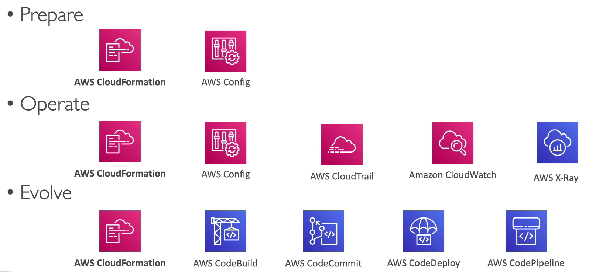
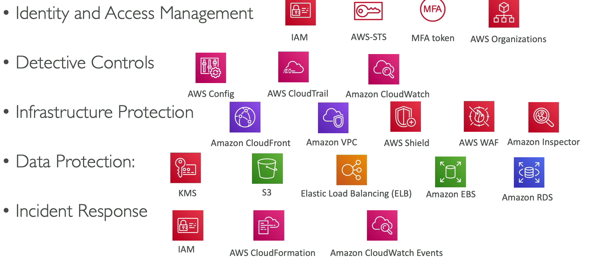
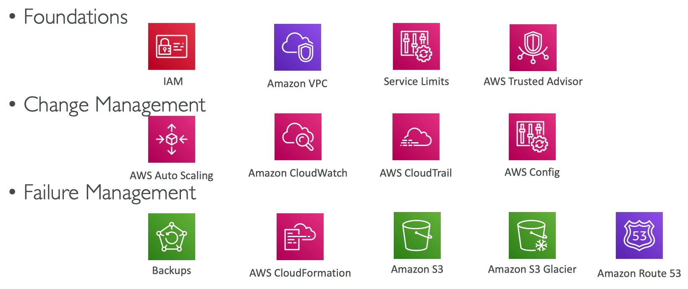
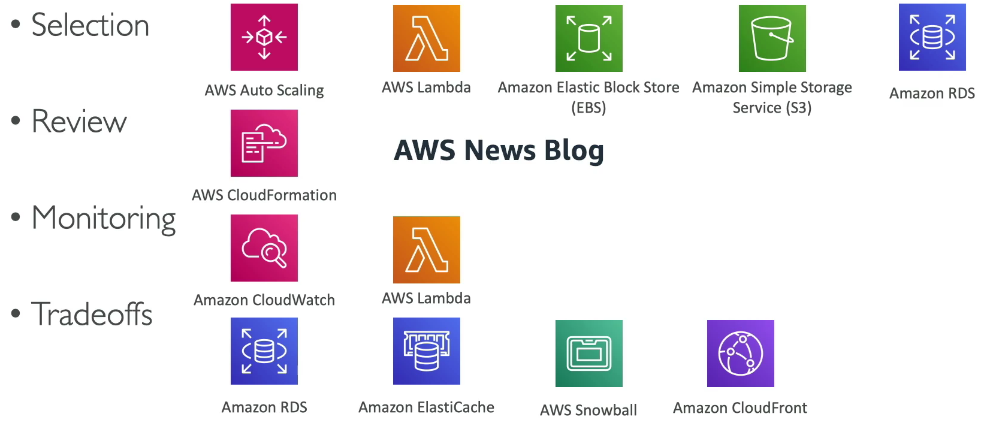
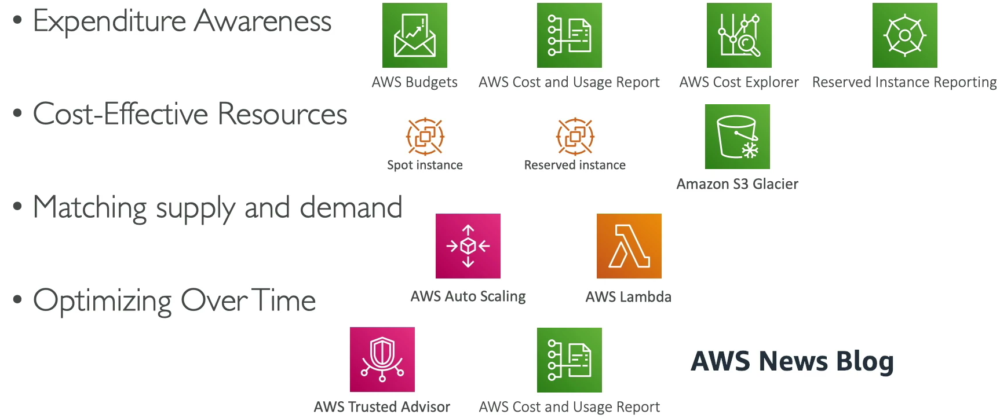
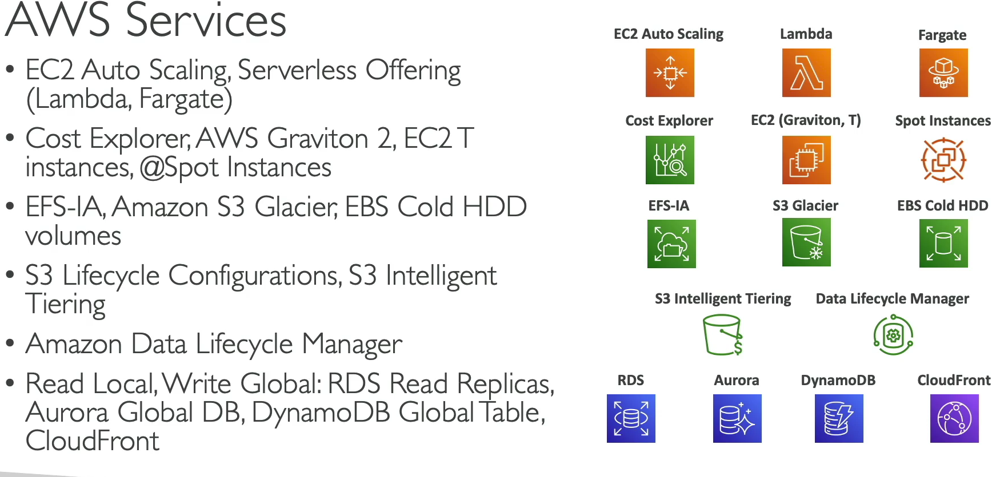
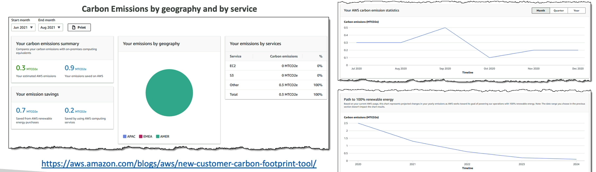
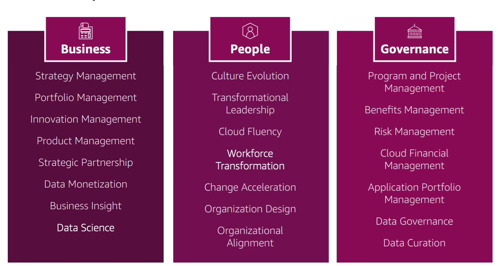
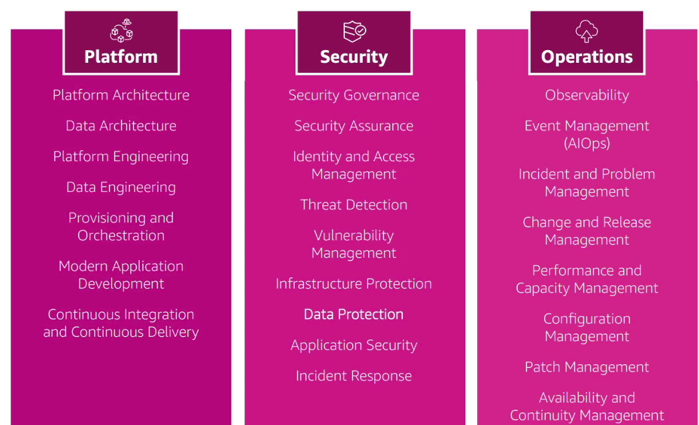
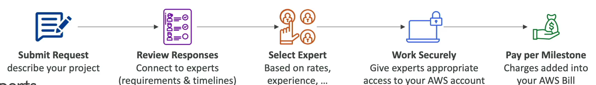

# AWS Architecting & Ecosystem

- [AWS Architecting \& Ecosystem](#aws-architecting--ecosystem)
  - [Well Architected Framework General Guiding Principles](#well-architected-framework-general-guiding-principles)
  - [AWS Cloud Best Practices - Design Principles](#aws-cloud-best-practices---design-principles)
  - [Well Architected Framework 6 Pillars](#well-architected-framework-6-pillars)
    - [1. Operational Excellence](#1-operational-excellence)
    - [2. Security](#2-security)
    - [3. Reliability](#3-reliability)
    - [4. Performance Efficiency](#4-performance-efficiency)
    - [5. Cost Optimization](#5-cost-optimization)
    - [6. Sustainability](#6-sustainability)
  - [AWS Well-Architected Tool](#aws-well-architected-tool)
  - [AWS Customer Carbon Footprint Tool](#aws-customer-carbon-footprint-tool)
  - [AWS Cloud Adoption Framework (AWS CAF)](#aws-cloud-adoption-framework-aws-caf)
    - [CAF Perspectives and Foundational Capabilities - Business Capabilities](#caf-perspectives-and-foundational-capabilities---business-capabilities)
    - [CAF Perspectives and Foundational Capabilities - Technical Capabilities](#caf-perspectives-and-foundational-capabilities---technical-capabilities)
    - [AWS CAF - Transformation Domains](#aws-caf---transformation-domains)
    - [AWS CAF - Transformation Phases](#aws-caf---transformation-phases)
  - [AWS Right Sizing](#aws-right-sizing)
  - [AWS Ecosystem - Free Resources](#aws-ecosystem---free-resources)
    - [AWS Ecosystem - AWS Support](#aws-ecosystem---aws-support)
  - [AWS Marketplace](#aws-marketplace)
  - [AWS Training](#aws-training)
  - [AWS Professional Services \& Partner Network (APN)](#aws-professional-services--partner-network-apn)
  - [AWS IQ](#aws-iq)
  - [AWS re:Post](#aws-repost)
  - [AWS Managed Services (AMS)](#aws-managed-services-ams)

## Well Architected Framework General Guiding Principles

- Stop guessing capacity needs.
- Test systems at production scale.
- Automate to facilitate architectural experimentation.
- Allow for evolutionary architectures based on changing requirements.
- Drive architectures using data.
- Improve through game days by simulating applications for flash sale days.

## AWS Cloud Best Practices - Design Principles

- **Scalability**: Scale both vertically and horizontally.
- **Disposable Resources**: Servers should be disposable and easily configured.
- **Automation**: Utilize serverless, infrastructure as a service, and auto-scaling.
- **Loose Coupling**: 
  - Break monolithic applications into smaller, loosely coupled components to prevent cascading failures.
- **Services, Not Servers**: Use managed services, databases, and serverless options instead of just EC2.

## Well Architected Framework 6 Pillars

### 1. Operational Excellence

- Ability to run and monitor systems for business value and improve supporting processes.
- **Design Principles**:
  - **Perform operations as code** - Infrastructure as code.
  - **Make frequent, small, reversible changes** - So that in case of failure, you can reverse it easily.
  - **Refine operations procedures frequently** and ensure team familiarity.
  - **Anticipate failure**.
  - **Learn from all operational failures**.
  - **Use managed services** to reduce operational burden.
  - **Implement observability for actionable insights** - performance, reliability, cost

### 2. Security

- Ability to protect information, systems, and assets while delivering business value through risk assessments and mitigation strategies.
- **Design Principles**:
  - **Implement a strong identity foundation** - centralized privilege management, principle of least privilege, IAM.
  - **Enable traceability** - integrate logs and metrics with systems.
  - **Apply security at all layers** - edge network, VPC, load balancer, instances, OS, application.
  - **Automate security best practices.**
  - **Protect data in transit and at rest** - encryption, tokenization, access control.
  - **Keep people away from data** - reduce or eliminate direct access.
  - **Prepare for security events** - run incident response simulations, use automation.

### 3. Reliability

- Ability to recover from disruptions, dynamically acquire resources, and mitigate misconfigurations or transient network issues.
- **Design Principles**:
  - **Test recovery procedures** - Use automation to simulate different failures or to recreate scenarios that led to failures before
  - **Automatically recover from failures** - Anticipate and remediate failures before they occur.
  - **Scale horizontally to increase aggregate system availability** - Distribute requests across multiple, smaller resources to ensure that they dont share a common point of failure.
  - **Stop guessing capacity** - Maintain the optimal level to satisfy demand without over or under provisioning - Use Auto Scaling.
  - **Manage change with automation** - Use automation to make changes to infraestructure.

### 4. Performance Efficiency

- Efficiently use computing resources to meet system requirements and maintain efficiency as demands change.
- **Design Principles**:
  - **Democratize advanced technologies** - Advance technologies become services and hence you can focus more on product development.
  - **Go global in minutes** - Easy deployment in multiple regions.
  - **Use serverless architectures** - Avoid burden of managing servers.
  - **Experiment frequently** - Easy to carry out comparative testing
  - **Mechanical sympathy** - Be aware of all AWS services

### 5. Cost Optimization

- Deliver business value at the lowest price point.
- **Design Principles**:
  - **Adopt a consumption model** - Pay only for what you use.
  - **Measure overall efficiency** - use CloudWatch.
  - **Stop spending on data center operations** - AWS does the infraestructure part and enables customer to focus on organizations projects.
  - **Analyze and attribute expenditure** - Accurate identification of system usage and cost, helps measure return on investment (ROI) - Make sure to use tags.
  - **Use managed and application level services to reduce costs of ownership** - As managed services operate at cloud scale, they can offer a lower cost per transaction or service.

### 6. Sustainability

- Minimize environmental impacts of running cloud workloads.
- **Design Principles**:
  - **Understand your impact** - Establish performance indicators, evaluate improvements.
  - **Establish sustainability goals** - Set long-term goals for each workload, model return on investment (ROI).
  - **Maximize utilization** - Right size each workload to maximize the energy efficiency of the underlying hardware and minimize idle resources.
  - **Anticipate and adopt new, more efficient hardware and software offerings** - and design for flexibility to adopt new technologies over time.
  - **Use managed services** - Shared services reduce the amount of infrastructure; Managed services help automate sustainability best practices as moving infrequent accessed data to cold storage and adjusting compute capacity.
  - **Reduce downstream impact of your cloud workloads** - Reduce the amount of energy or resources required to use your services and reduce the need for your customers to upgrade their devices.

## AWS Well-Architected Tool

- Free tool to review architectures against the 6 pillars and adopt best practices.
- **How it works**:
  - Select your workload and answer questions.
  - Review answers against the 6 pillars.
  - Obtain advice: videos, documentation, reports, and dashboards.

## AWS Customer Carbon Footprint Tool
- Track, measure, review and forecast the Carbon emissions generated from your AWS usage.
- Helps you meet your own sustainability goals

## AWS Cloud Adoption Framework (AWS CAF)

- Helps you build and the execute a comprehensive plan for your digital transformation through innovative use of AWS
- Created by AWS Professional by taking advantage of AWS Best Practices and lessons learned from 1000s of customers.
- AWS CAF identifies specific organizational capabilities that underpin successful cloud transfromations.
- AWS CAF groups its capabilities in six perpectives: **Business, People, Governance, Platform, Security, and Operations**.
- 
### CAF Perspectives and Foundational Capabilities - Business Capabilities
- **Business Perspective** helps ensure that your cloud investments accelerate your digital transformation ambitions and business outcomes.
- **People Perspective** serves **as a bridge between technology and business** accelerating the cloud journey to help organizations more rapidly envolve to a culture of continuous growth, learning, and where change becomes business-as-normal, with focus on culture, organizational structure, leadership and workforce. 
- **Governance Perspective** helps you orchestrate your cloud initiatives while maximizing organizational benefits and minimizing transormation-related risks.

### CAF Perspectives and Foundational Capabilities - Technical Capabilities
- **Platform Perspective** helps you build an enterprise-grade, scalable hybrid cloud platform: modernize existing workloads; and implement new cloud-native solutions.
- **Security Perspective** helps you achieve the confidentiality, integrity and availability of your data and cloud workloads.
- **Operations Perspective** helps ensure that your cloud services are delivered at a level that meets the needs of your business.

### AWS CAF - Transformation Domains
- **Technology** - Using the cloud to migrate and modernize legacy infrastructure, applications, data and analytics platforms.
- **Process** - Digitizing, automating and optimizing your business operations
  - leveraging new data and analytics platforms to create actionable insights.
  - Using machinelearning (ML) to improve your customer service experience. 
- **Organization** - Reimagining your operation model
  - Organizing your teams around products and value streams
  - Leveraging agile methods to rapidly iterate and evolve
- **Product** - Reimagining your business model by creating new value propositions (products and services) and revenue models.

### AWS CAF - Transformation Phases
- **Envision** - Demostrate how the Cloud will accelerate business outcomes by identifying transformation oportunities and create a foundation for your digital transformation.
- **Align** - Identify capability gaps across the 6 AWS CAF Perspectives which results in an Action Plan.
- **Launch** - Build and deliver pilot initiatives in production and demostrate incremental business value.
- **Scale** - Expand pilot initiatives to the desired scale while realizing the desired business benefits.

## AWS Right Sizing

- EC2 has many instance types, but choosing the most powerful instance type is not best choice, because the cloud is **elastic**.
- Right sizing is the process of matching instance types and sizes to your workload performance and capacity requirements **at the lowest possible cost**.
- **Scaling up is easy so always start small** and scale up as needed.
- Its also the process of looking at deplyed instances and identifying opportunities to eliminate or downsize without compromising capacity or other requirements, which results in lower costs.
- Its important to Right Size
  - **Before a Cloud Migration**
  - **Continuosly after the cloud onboarding process (requirements change over time)**
- Right sizing involves starting small and scaling up easily, continuously adjusting after cloud onboarding, and using tools like CloudWatch, Cost Explorer, and Trusted Advisor to monitor and optimize resource usage.

## AWS Ecosystem - Free Resources

- **AWS Blogs**: [AWS Blogs](https://aws.amazon.com/blogs/aws/)
- **AWS Forums**: [AWS Forums](https://forums.aws.amazon.com/index.jspa)
- **AWS Whitepapers & Guides**: [AWS Whitepapers & Guides](https://aws.amazon.com/whitepapers)
- **AWS Quick Starts**: [AWS Quick Starts](https://aws.amazon.com/quickstart/)
  - Automated, gold-standard deployments in the AWS Cloud.
  - Examples: WordPress on AWS, leveraging CloudFormation.
- **AWS Solutions**: [AWS Solutions](https://aws.amazon.com/solutions/)
  - Vetted technology solutions for the AWS Cloud.
  - Example - AWS Landing Zone (secure, multi-account environment).

### AWS Ecosystem - AWS Support

| DEVELOPER                                               | BUSINESS                                                      | ENTERPRISE                                                      |
| ------------------------------------------------------- | ------------------------------------------------------------- | --------------------------------------------------------------- |
| Business hours email access to Cloud Support Associates | 24x7 phone, email, and chat access to Cloud Support Engineers | Access to a Technical Account Manager (TAM)                     |
| General guidance: < 24 business hours                   | Production system impaired: < 4 hours                         | Concierge Support Team (for billing and account best practices) |
| System impaired: < 12 business hours                    | Production system down: < 1 hour                              | Business-critical system down: < 15 minutes                     |

## AWS Marketplace

- Digital catalog with thousands of software listings from independent software vendors.
- Examples:
  - Custom AMIs, CloudFormation templates, SaaS, containers.
- Purchases go into your AWS bill.
- You can sell your own solutions on the AWS Marketplace.

## AWS Training
- AWS Digital (online) and Classroom Training (in-person or virtual)
- AWS Private Training (for your organization)
- Training and Certification for the U.S. Goverment
- Training and Certification for the Enterprise
- AWS Academy helps universities teach AWS

## AWS Professional Services & Partner Network (APN)
- The WS Professional Service organization is a global team of experts
- They work alongside your team and a chosen member of the APN
- **APN Technology Partners**: providing hardware, connectivity and software
- **APN Consulting Partners**: professional service firm to help build on AWS
- **APN Training Partners**: find who can help you learn AWS
- **AWS Competency Program**: AWS Competencies are granted to APN Partners who have demostrated technical proficiency and proven customer success in specialized solution areas.
- **AWS Navigate Program**: help Partners become better Partners

## AWS IQ
- Quickly find professional help for your AWS project
- Engage and pay AWS Certified 3rd party experts for on-demand project work
- Video conferencing, contract management, secure collaboration, integrated billing
- **For Customers**

- **For Experts**

## AWS re:Post
- **AWS-managed Q&A service** offering crowd-sourced, expert-reviewed answers to your technical questions about AWS that replaces the original AWS Forums.
- Part of the AWS Free Tier
- Community members can earn reputation points to build up their community experts status by providing accepted answers and reviewing answers from other users
- **Questions from AWS Premium Support customers that do not receive a response from the community are passed on to AWS Support Engineers**
- AWS re:Post is not intended to be used for questions that are time-sensitive or involve any propietary information
- **Knowledge Center** - Contains the most frequent & common questions and requests

## AWS Managed Services (AMS)

- Provides infraestructure and applications support on AWS
- **AMS offers a team of AWS experts** who manage and operate your infraestructure for security, reliability and availability
- Helps organizations offload routine management tasks and focus on their business objectives.
- Fully managed service, so AWS handles common activities such as change requests, monitoring, patch management, security and backup services
- Implementes best practices and maintains your AWS infraestructure to reduce your operational overhead and risks
- AMS business hours are 24/365